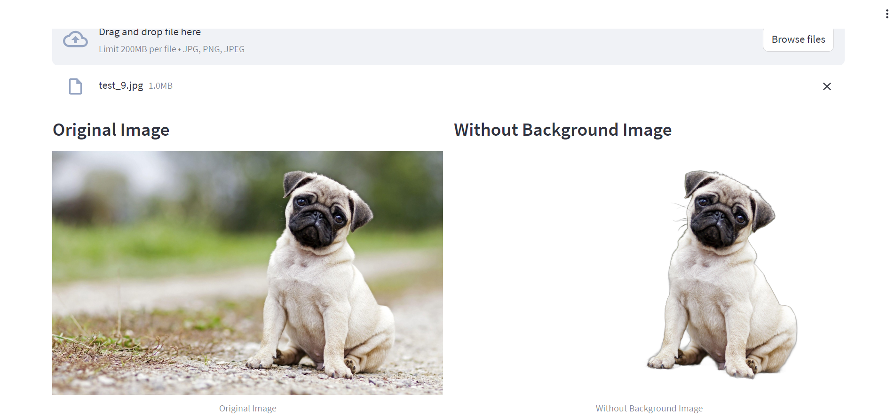

# Image Background Removal

This web app removes the background of any image and gives you an image which contains only foreground object.


## Run Locally

First create an virtual environment in your working directory.

```bash
python -m venv <environment-name>
```

Activate your virtual environment (for windows).

```bash
<environment-name>\Scripts\activate
```

Install required libraries to run these web app (for windows).

```bash
pip install -r requirements.txt
```

Run the streamlit command to launch the web app (for windows).

```bash
streamlit run app.py
```  
## Screenshots




